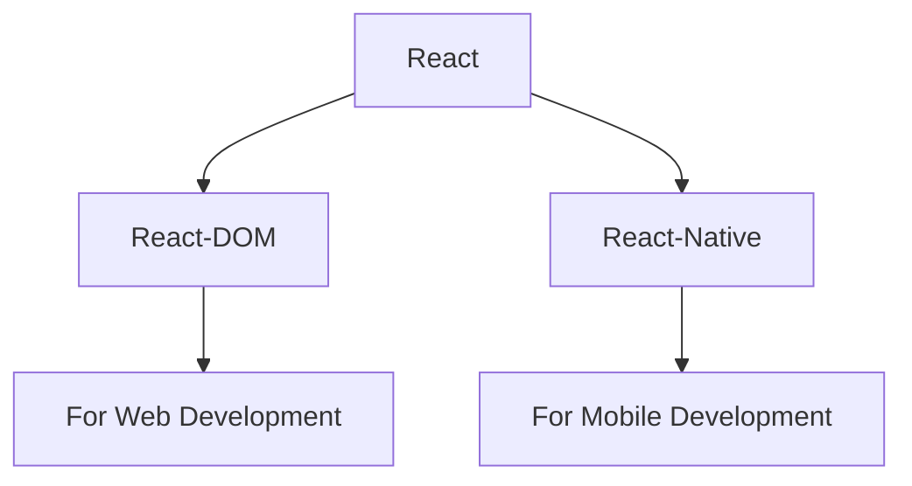

# React JS Notes

# # React Library 

- React is JavaScript Library.
- React is used to Single Page Application (Complete Website in Single Page).
- In React library there are two attachments.



# # How to Create project in React ??

- **npm** --> `Node Pakage Manager` (Allow us to install some libraries).
- **npx** --> `Node Pakage Executer`

## There are two ways to create project in React.

**`(i)` 1st Way to create project in React.**

--> It is Time Taking Proccess.  


### Steps to create Project

- **`1.`** Install node js in your PC from browser.
- **`2.`** Change directory to Folder in which you create React-Project.
- **`3.`** CMD to Create Project --> **`npx create-react-app Name_of_Project`**  
  - Project is created.
  - React Pacakge is installed

- **`4.`** CMD to Run Project --> **`npm run start`**

- **`5.`** CMD for Bulid --> **`npm run build`**  
  - A new build folder is created.
  - In bulid folder ReactJS code converted into JS code.
  - In production (client) bulid folder is served.

 
**`(ii)` 2nd Way to create project in React.**

--> By Vite (Bundller).  
--> It is faster than normal installation.

### Steps to create Project

- **`1.`** CMD to Create Project --> **`npm create vite@latest`**
  
  - `Project Name` : Name_of_Project
  - `Select framework` : react
  - `Select Variant` : JavaScript
  - Enter and Project is created.
 
- **`2.`** CMD to Run Project --> **`npm run dev`**

# # File Structure in React JS

**(1) `node modules`** --> It has all the installed node packages.  

**(2) `public`** -->  It contains static files that don't change. 

**(3) `src`** --> Main folder for the React code.  
- **`components`** --> Reusable parts of the UI, like buttons or headers.  
- **`assets`** --> Images, fonts, and other static files.  
- **`styles`** --> CSS or stylesheets.

**(4) `package.json`** It contains information about this project like `name, version, dependencies` on other react packages.  

**(5) `vite.config.js`** It contains vite config. 


# # Components in React JS 

- Components help us write reusable, modular and better organized code.
- React application is a tree of components with App Component as the root bringing everything together.

## Types of Components 

**(i) `Class Components`**

- **Stateful** : Can manage state.  
- **Lifecycle** : Access to lifecycle methods.  
- **Verbose** : More boilerplate code.  
- Not Preferred anymore.

**(i) `Functional Components`**

- Initially stateless.  
- Can use Hooks for state and effects.  
- Simpler and more concise.  
- More Popular.

### Example :-
- Component Folder > Item
``` jsx
function Item() {
    return(
        <p className="component.">This is a Component.</p>
    )
}

export default Item;
```
- Usage of Item Component in App.jsx

``` jsx
import Item from './components/Item'

function App() {
  return (
    <Item/>                               /* Output : This is a Component.*/             
  )
}

export default App

```

# # Props 

- Props (short for "properties") are used to pass information from one component to another.
-  The main purpose of props is to allow a parent component to send data to its child components.

### Example :-

- **App Component** (App.js) : Renders the Parent component.

``` jsx
import React from 'react';
import Parent from './Parent';

function App() {
    return (
        <div>
            <Parent />  {/* Render the Parent component */}
        </div>
    );
}

export default App;
```

- **Parent Component** (Parent.js) : Renders a heading and the Child component and passes the prop name="Jiya" to the Child component.

``` jsx
import React from 'react';
import Child from './Child';

function Parent() {
    return (
        <div>
            <h1>Welcome to the Parent Component!</h1>
            <Child name="John" />  {/* Passing the 'name' prop with value "John" */}
        </div>
    );
}

export default Parent;
```

- **Child Component** (Child.js): Receives the name prop and displays Hello, Jiya!

``` jsx
import React from 'react';

function Child(props) {
    return <h2>Hello, {props.name}!</h2>; 
}

export default Child;
```


