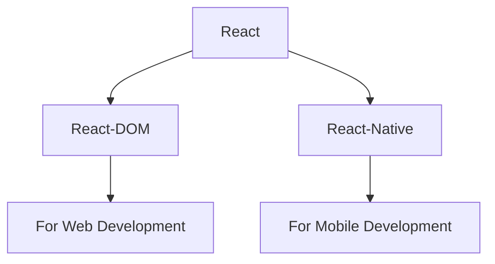

# React JS Notes

# # React Library 

- React is JavaScript Library.
- React is used to Single Page Application (Complete Website in Single Page).
- In React library there are two attachments.

# # How to Create project in React ??

- **npm** --> `Node Pakage Manager` (Allow us to install some libraries).
- **npx** --> `Node Pakage Executer`

## There are two ways to create project in React.

**`(i)` 1st Way to create project in React.**

--> It is Time Taking Proccess.  

### Steps to create Project

- **`1.`** Install node js in your PC from browser.
- **`2.`** Change directory to Folder in which you create React-Project.
- **`3.`** CMD to Create Project --> **`npx create-react-app Name_of_Project`**  
  - Project is created.
  - React Pacakge is installed

- **`4.`** CMD to Run Project --> **`npm run start`**

- **`5.`** CMD for Bulid --> **`npm run build`**  
  - A new build folder is created.
  - In bulid folder ReactJS code converted into JS code.
  - In production (client) bulid folder is served.

 
**`(ii)` 2nd Way to create project in React.**

--> By Vite (Bundller).  
--> It is faster than normal installation.

### Steps to create Project

- **`1.`** CMD to Create Project --> **`npm create vite@latest`**
  
  - `Project Name` : Name_of_Project
  - `Select framework` : react
  - `Select Variant` : JavaScript
  - Enter and Project is created.
 
- **`2.`** CMD to Run Project --> **`npm run dev`**

